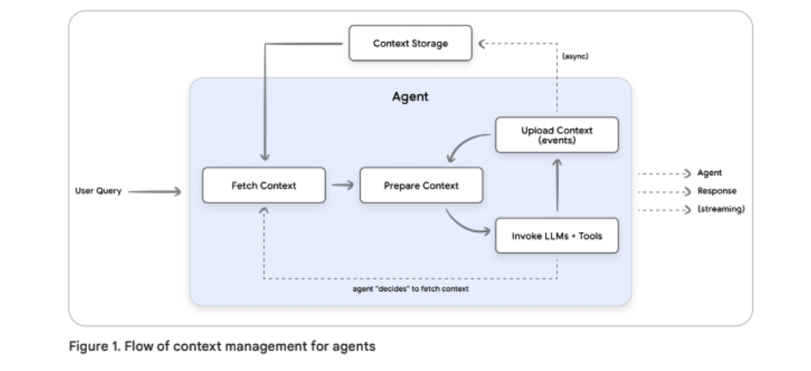

### Day 3

Context Engineering: Sessions & Memory

- Context Engineering

  - master controller / dynamic management **(orchestration)**
  - stateful
  - Challenges: context rot (context grows) → Fight use dynamic history mutation

- Sessions (Short term memory management)
  - containers for one whole conversation, holds context fore jusst one continous conversation / need isolation and compaction **(workbench)**
  - Two Parts:
    - Events: strict chronological log
    - State: agent's working memory
  - Async background processing is key for sophisticated compaction

- Memory(Long term memory management)
  - persistence accross multiple sessions **(filing cabinet)**
  - strctured memories : knowledge graph
  - Memory Generation: LLMDriven ETL, computational expensive → async